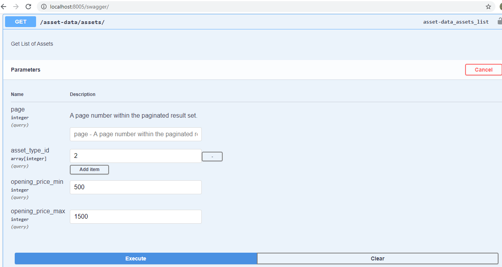
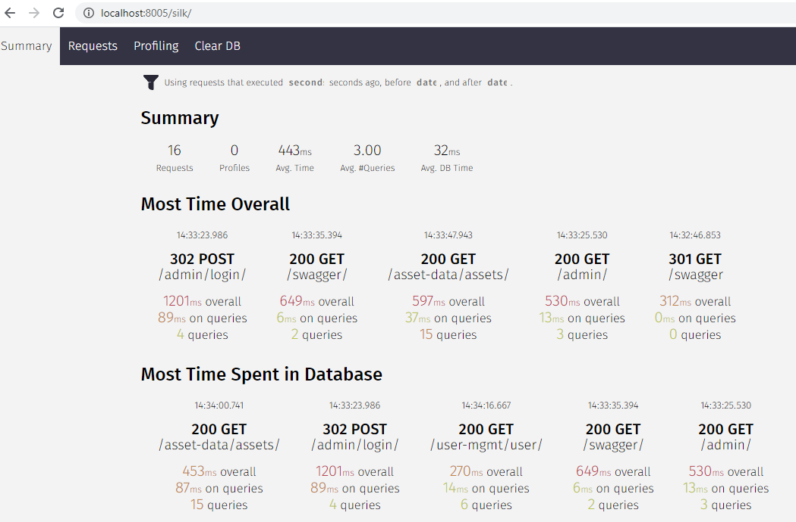
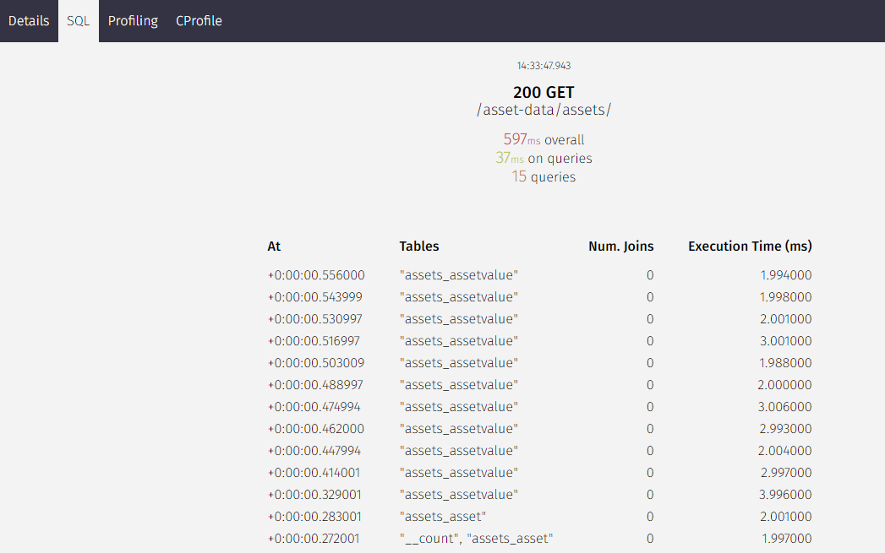

# Asset Management - Django rest-framework example

This project is used to demonstrate usage of Django rest framework. Below points are covered 
in the creation of asset management portal.
1. Creation of endpoints using class based views (viewsets)
2. Serilizers to handle the application data
3. drf-yasg swagger generator to automatic generation of api docs
4. Unit tests using factory and faker

### Libraries used to build the project:
1. Python 3.8
2. Django 3
3. Django Rest Framework 
4. drf-yasg - Swagger generator
5. django-silk - 

### Set up Virtual Environment
Create Virtual environment

`python -m venv env`

Then activate the virtual enviornment

In Linux

`source env/bin/activate`

In windows

`cd env/Scripts`

`activate`

To deactivate the virtual environment

`deactivate`

### Install libraries
After activating the virtual env, install required libraries using below command:

`pip install -r requirements.txt`

### Make migrations

Run below commands to migrate and create schemas in sqllite db

`python manage.py makemigrations` and `python manage.py migrate`

### Run unit tests

`python manage.py test`

## Run application

Use below command to run application: You can give any available port

`python manage.py runserver 8005`

## Test Application

You can use swagger to test the endpoints. Please use below url to open swagger docs

`http://localhost:8005/swagger/`

## Enable Silk Profiling

Silk is a live profiling and inspection tool for Django framework. You can check more details [here](https://github.com/jazzband/django-silk) 

It is very handy tool to evaluate performance of any particular endpoint/service.  It helps us to understand how django 
queries the Database, number of queries executed and time taken to execute each query.

You can check detail execution of DB transactions in SQL view 

Turn on Python in-built cProfiler using below settings:

    SILKY_PYTHON_PROFILER = True

